# E-commerce SPA - Microservices Application

[](https://microservices.io/)
[](https://reactjs.org/)
[](https://fastapi.tiangolo.com/)
[](https://aws.amazon.com/dynamodb/)
[](https://aws.amazon.com/lambda/)
[](https://terraform.io/)

## Table of Contents

- [Architecture and Design Choices](#architecture-and-design-choices)
- [Setup, Deployment, and Run Instructions](#setup-deployment-and-run-instructions)
- [Authentication Flow Testing Instructions](#authentication-flow-testing-instructions)
- [Terraform Infrastructure Template](#terraform-infrastructure-template)

## Architecture and Design Choices

**Overview**: Serverless microservices architecture with React SPA frontend, FastAPI backend services, DynamoDB NoSQL database, AWS Cognito authentication, and full infrastructure-as-code deployment.

**Key Design Decisions**:
- **Serverless-First**: Lambda functions for automatic scaling, zero infrastructure management
- **Microservices**: Separate product and cart services for independent deployment and scaling
- **Container-Based**: Docker images deployed to Lambda for consistent runtime environments
- **NoSQL Database**: DynamoDB for seamless scaling with AWS ecosystem integration
- **Authentication Strategy**: AWS Cognito for production, mock auth for development
- **Infrastructure-as-Code**: Complete Terraform automation for reproducible deployments

### Production Architecture (AWS Serverless)

```mermaid
graph TB
    subgraph "Client Layer"
        User["👤 User<br/>Browser/Mobile"]
    end
    
    subgraph "Frontend Layer"
        Frontend["📱 React SPA<br/>Single Page Application<br/><small>Frontend Lambda</small>"]
    end
    
    subgraph "API Layer"
        APIGateway["🌐 AWS API Gateway<br/>Central Request Router<br/><small>All HTTP Requests</small>"]
    end
    
    subgraph "Service Layer"
        StaticAssets["📁 Static Assets<br/>HTML, CSS, JS<br/><small>Frontend Lambda</small>"]
        ProductService["🛍️ Product Service<br/>Catalog Management<br/><small>Lambda Function</small>"]
        CartService["🛒 Cart Service<br/>Shopping Cart<br/><small>Lambda Function</small>"]
        Cognito["🔐 AWS Cognito<br/>User Authentication<br/><small>Identity Provider</small>"]
    end
    
    subgraph "Data Layer"
        ProductDB["📊 Products Table<br/>DynamoDB<br/><small>NoSQL Database</small>"]
        CartDB["📊 Carts Table<br/>DynamoDB<br/><small>NoSQL Database</small>"]
    end
    
    %% Flow connections
    User --> Frontend
    Frontend --> APIGateway
    
    APIGateway --> |"GET /static/*<br/>Assets"| StaticAssets
    APIGateway --> |"GET,POST /api/products/*<br/>Product APIs"| ProductService
    APIGateway --> |"GET,POST /api/cart/*<br/>Cart APIs"| CartService
    APIGateway --> |"POST /auth/*<br/>Authentication"| Cognito
    
    ProductService --> ProductDB
    CartService --> CartDB
    
    %% Styling
    style User fill:#e1f5fe,stroke:#0277bd,stroke-width:2px,color:#000
    style Frontend fill:#e8f5e8,stroke:#2e7d32,stroke-width:3px,color:#000
    style APIGateway fill:#fff3e0,stroke:#ef6c00,stroke-width:4px,color:#000
    style StaticAssets fill:#f3e5f5,stroke:#7b1fa2,stroke-width:2px,color:#000
    style ProductService fill:#e0f2f1,stroke:#00695c,stroke-width:2px,color:#000
    style CartService fill:#e0f2f1,stroke:#00695c,stroke-width:2px,color:#000
    style Cognito fill:#fff8e1,stroke:#f57f17,stroke-width:2px,color:#000
    style ProductDB fill:#fce4ec,stroke:#c2185b,stroke-width:2px,color:#000
    style CartDB fill:#fce4ec,stroke:#c2185b,stroke-width:2px,color:#000
```



### Local Development Architecture

```mermaid
graph TB
    subgraph "Client Layer"
        Dev["👤 Developer<br/>Local Browser<br/><small>localhost:3001</small>"]
    end
    
    subgraph "Docker Desktop Environment"
        subgraph "Frontend Layer"
            ReactApp["📱 React SPA<br/>Development Server<br/><small>Docker Container • Port 3001</small>"]
        end
        
        subgraph "Service Layer"
            ProductAPI["🛍️ Product Service<br/>FastAPI + Uvicorn<br/><small>Docker Container • Port 8001</small>"]
            CartAPI["🛒 Cart Service<br/>FastAPI + Uvicorn<br/><small>Docker Container • Port 8002</small>"]
        end
        
        subgraph "Data Layer"
            DynamoLocal["📊 DynamoDB Local<br/>NoSQL Development DB<br/><small>Docker Container • Port 8000</small>"]
        end
    end
    
    %% Flow connections
    Dev --> ReactApp
    ReactApp --> ProductAPI
    ReactApp --> CartAPI
    
    ProductAPI --> DynamoLocal
    CartAPI --> DynamoLocal
    
    ProductAPI -.-> |"Cross-service<br/>Communication"| CartAPI
    
    %% Styling
    style Dev fill:#e1f5fe,stroke:#0277bd,stroke-width:2px,color:#000
    style ReactApp fill:#e8f5e8,stroke:#2e7d32,stroke-width:3px,color:#000
    style ProductAPI fill:#e0f2f1,stroke:#00695c,stroke-width:2px,color:#000
    style CartAPI fill:#e0f2f1,stroke:#00695c,stroke-width:2px,color:#000
    style DynamoLocal fill:#fce4ec,stroke:#c2185b,stroke-width:2px,color:#000
```



**Technology Stack**:
- **Frontend**: React 18, React Router, Context API, Tailwind CSS
- **Backend**: FastAPI, Pydantic, Boto3, JWT authentication
- **Database**: DynamoDB (Local + AWS)
- **Authentication**: AWS Cognito + JWT tokens
- **Infrastructure**: AWS Lambda, API Gateway, ECR
- **DevOps**: Docker, Terraform, Make, Docker Compose

## Setup, Deployment, and Run Instructions

### Prerequisites
- **Docker Desktop** (required)
- **AWS CLI** configured (for AWS deployment)
- **Terraform** >= 1.0 (for AWS deployment)
- **Node.js 18+** and **Python 3.11+** (for manual setup)

### Local Development Setup

**Option 1: Docker (Recommended)**
```bash
# 1. Clone and setup environment
git clone <repository-url> && cd ecom-spa
cp backend/env.example backend/.env
cp frontend/env.example frontend/.env

# 2. Start all services
make dev
# OR: docker-compose -f docker-compose.yml -f docker-compose.dev.yml up --build

# 3. Setup database (first time only)
make setup-dynamodb
# OR: python scripts/setup-dynamodb.py
```

**Option 2: Manual Setup**
```bash
# 1. Start DynamoDB Local
docker run -p 8000:8000 -d amazon/dynamodb-local:latest

# 2. Install backend dependencies
pip install -r backend/requirements.txt

# 3. Start services (separate terminals)
cd backend && PYTHONPATH=$(pwd) uvicorn product-service.app.main:app --reload --port 8001
cd backend && PYTHONPATH=$(pwd) uvicorn cart-service.app.main:app --reload --port 8002

# 4. Start frontend (optional)
cd frontend && npm install && npm start
```

**Access URLs:**
- Frontend: http://localhost:3001
- Product Service API: http://localhost:8001/docs
- Cart Service API: http://localhost:8002/docs
- DynamoDB Local: http://localhost:8000

### AWS Production Deployment

**1. Setup AWS Credentials**
```bash
aws configure  # Enter AWS Access Key, Secret Key, Region
aws sts get-caller-identity  # Verify credentials
```

**2. Configure Terraform Variables**
```bash
cp terraform/terraform.tfvars.example terraform/terraform.tfvars
# Edit required values:
# - project_name, environment, aws_region
# - cognito_domain_prefix (must be globally unique)
# - jwt_secret_key
```

**3. Deploy Infrastructure**
```bash
cd terraform
terraform init
terraform plan -no-color | tee plan.txt  # Review changes
terraform apply -auto-approve
```

**4. Get Deployment URLs**
```bash
terraform output api_gateway_url
terraform output -json cognito_config
```

**5. Optional: Seed Database**
```bash
terraform apply -target=null_resource.seed_dynamodb_products -auto-approve
```

### Daily Development Commands

```bash
# Start/stop local environment
make dev                    # Start all services
make clean                  # Stop and clean containers

# Test APIs
make test-api              # Test all endpoints

# View logs
docker-compose logs -f     # Follow all logs
docker-compose logs cart-service  # Specific service logs

# Restart specific service
docker-compose restart product-service
```

### Teardown

```bash
# Local: Stop containers
docker-compose down -v

# AWS: Destroy infrastructure
cd terraform && terraform destroy -auto-approve
```

## Authentication Flow Testing Instructions

### Local Development Authentication

**Pre-configured Test Users:**
- **Admin**: `admin@example.com` / `admin123`
- **User**: `user@example.com` / `user123`

**Authentication Flow Test (Local):**

```bash
# 1. Test login and get JWT token
curl -X POST http://localhost:8002/api/auth/login \
  -H "Content-Type: application/json" \
  -d '{"username": "admin@example.com", "password": "admin123"}'

# Response: {"access_token": "eyJ...", "token_type": "bearer"}
export JWT_TOKEN="your-token-from-response"

# 2. Test protected endpoints
curl -H "Authorization: Bearer $JWT_TOKEN" http://localhost:8002/api/cart

# 3. Test cart operations
curl -X POST -H "Authorization: Bearer $JWT_TOKEN" \
  -H "Content-Type: application/json" \
  -d '{"product_id": "1", "quantity": 2}' \
  http://localhost:8002/api/cart/add

# 4. Test frontend authentication flow
# - Visit http://localhost:3001
# - Click "Login"
# - Enter credentials: admin@example.com / admin123
# - Verify redirect to products page
# - Test cart functionality
```

### AWS Production Authentication

**AWS Cognito Authentication Flow:**

```bash
# 1. Get Cognito configuration after deployment
cd terraform
terraform output -json cognito_config

# 2. Test Cognito signup (via frontend)
# - Visit deployed frontend URL
# - Click "Login" → redirects to Cognito Hosted UI
# - Click "Sign up" and create new account
# - Verify email address via confirmation code
# - Complete sign-up process

# 3. Test login flow
# - Return to frontend and click "Login"
# - Enter credentials in Cognito UI
# - Verify successful redirect with authorization code
# - Confirm cart operations work with Cognito JWT tokens

# 4. Test API with Cognito token
# After login via frontend, extract token from browser localStorage
# Use token for direct API calls:
curl -H "Authorization: Bearer $COGNITO_JWT_TOKEN" \
  https://your-api-gateway-url/api/cart
```

**Authentication Verification Checklist:**
- [ ] Local login returns valid JWT token
- [ ] Protected endpoints require valid token
- [ ] Invalid tokens are rejected (401 error)
- [ ] Frontend login/logout flow works
- [ ] Cart operations persist between sessions
- [ ] AWS Cognito signup/verification works
- [ ] OAuth2 redirect flow completes successfully

## Terraform Infrastructure Template

**Purpose**: Complete Infrastructure-as-Code solution for serverless AWS deployment with zero manual configuration.

### What Terraform Deploys

**Core Infrastructure:**
- **DynamoDB Tables**: `ecom-products` and `ecom-carts` with proper indexes and scaling
- **ECR Repositories**: Container registries for frontend, product-service, and cart-service
- **Lambda Functions**: Containerized services with automatic scaling and monitoring
- **API Gateway**: REST API with routes, CORS, and Cognito authorization integration
- **AWS Cognito**: User Pool, Identity Pool, and Hosted UI for authentication
- **IAM Roles**: Least-privilege access controls for all services

**Automation Features:**
- **Docker Build & Push**: Automatically builds container images and pushes to ECR
- **Environment Configuration**: Injects API Gateway URLs and Cognito config into Lambda environments
- **Database Seeding**: Optional automated population of products table
- **Output Generation**: Provides all necessary URLs and configuration for frontend integration

### Key Terraform Modules

```mermaid
graph TD
    subgraph "Infrastructure as Code"
        Root["🏗️ terraform/main.tf<br/>Root Configuration<br/><small>Orchestrates all modules</small>"]
        Variables["⚙️ variables.tf<br/>Configuration<br/><small>Environment parameters</small>"]
    end
    
    subgraph "Core Infrastructure"
        DynamoDB["📊 modules/dynamodb/<br/>Database Layer<br/><small>Tables & indexes</small>"]
        ECR["📦 modules/ecr/<br/>Container Registry<br/><small>Docker repositories</small>"]
    end
    
    subgraph "Compute & API"
        Lambda["⚡ modules/lambda/<br/>Serverless Functions<br/><small>Business logic</small>"]
        APIGateway["🌐 modules/api-gateway/<br/>API Management<br/><small>REST API & routing</small>"]
    end
    
    subgraph "Security & Auth"
        Cognito["🔐 modules/cognito/<br/>Identity Provider<br/><small>User authentication</small>"]
    end
    
    %% Dependencies
    Root --> DynamoDB
    Root --> ECR
    Root --> Lambda
    Root --> APIGateway
    Root --> Cognito
    Variables --> Root
    
    ECR --> Lambda
    Lambda --> APIGateway
    DynamoDB --> Lambda
    Cognito --> APIGateway
    
    %% Styling
    style Root fill:#673ab7,color:#fff,stroke:#4527a0,stroke-width:4px
    style Variables fill:#f5f5f5,stroke:#616161,stroke-width:2px,color:#000
    style DynamoDB fill:#e8f5e8,stroke:#2e7d32,stroke-width:2px,color:#000
    style ECR fill:#fff3e0,stroke:#ef6c00,stroke-width:2px,color:#000
    style Lambda fill:#e3f2fd,stroke:#1976d2,stroke-width:2px,color:#000
    style APIGateway fill:#fff8e1,stroke:#f57f17,stroke-width:2px,color:#000
    style Cognito fill:#fce4ec,stroke:#c2185b,stroke-width:2px,color:#000
```



### Terraform Workflow

**1. Resource Creation Sequence:**
- ECR repositories → Docker image builds → Lambda functions → API Gateway → Cognito integration

**2. Automatic Dependency Management:**
- Lambda functions wait for ECR images
- API Gateway routes depend on Lambda function ARNs
- Cognito callback URLs use API Gateway endpoints

**3. Configuration Injection:**
- API Gateway URLs automatically configured in Lambda environment variables
- Cognito configuration exposed via Terraform outputs for frontend integration
- Database connection strings and AWS region automatically set

### Key Benefits

- **Zero Manual Setup**: Complete deployment with single `terraform apply`
- **Environment Consistency**: Identical infrastructure across dev/staging/prod
- **Automatic Scaling**: Serverless components scale based on demand
- **Cost Optimization**: Pay-per-use Lambda and DynamoDB pricing
- **Security Best Practices**: IAM roles with minimal required permissions
- **Rollback Capability**: Infrastructure versioning and state management

### Customization Points

**Required Variables** (set in `terraform.tfvars`):
- `project_name`: Resource naming prefix
- `environment`: Deployment environment (dev/staging/prod)
- `aws_region`: Target AWS region
- `cognito_domain_prefix`: Unique domain for Cognito Hosted UI
- `jwt_secret_key`: Secret for local JWT token generation

**Optional Overrides:**
- Lambda memory/timeout settings
- DynamoDB read/write capacity modes
- API Gateway rate limiting
- Cognito password policies

This Terraform template eliminates manual AWS console configuration and ensures reproducible, scalable deployments across multiple environments.