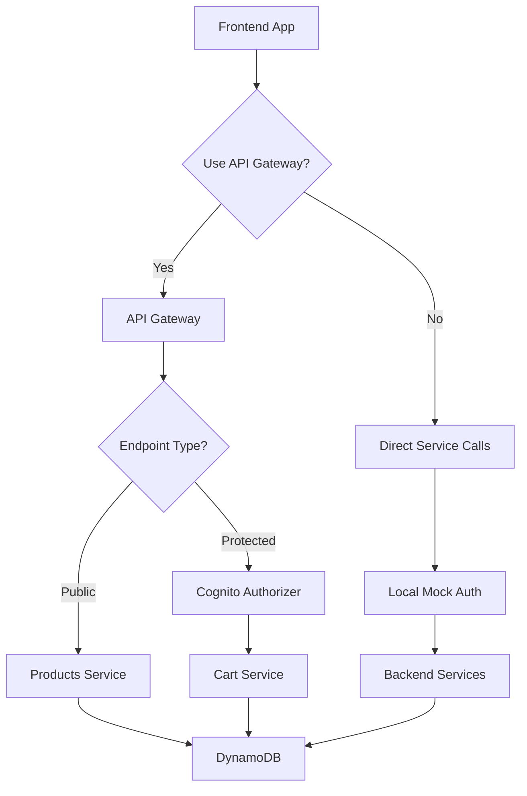

# AWS Cognito Authentication Setup

This document provides comprehensive instructions for setting up and using AWS Cognito authentication in the E-commerce SPA application.

## Overview

The application supports two authentication modes:
- **Local Development**: Uses mock authentication for development without AWS dependencies
- **Production/Cloud**: Uses AWS Cognito for secure, scalable authentication

## Table of Contents

1. [Architecture Overview](#architecture-overview)
2. [Local Development Setup](#local-development-setup)
3. [AWS Cognito Setup](#aws-cognito-setup)
4. [Terraform Deployment](#terraform-deployment)
5. [Frontend Configuration](#frontend-configuration)
6. [Backend Configuration](#backend-configuration)
7. [Testing](#testing)
8. [Troubleshooting](#troubleshooting)

## Architecture Overview

### Authentication Flow



### Components

- **Frontend**: React app with AWS Amplify SDK
- **API Gateway**: AWS REST API with Cognito authorization
- **Backend**: FastAPI services with unified auth verification
- **Load Balancer**: AWS ALB for backend service routing
- **Cognito**: User Pool + Identity Pool for authentication
- **Terraform**: Infrastructure as Code for AWS resources

## Local Development Setup

### Prerequisites

- Node.js 18+ and npm
- Python 3.11+
- Docker and Docker Compose

### Quick Start

1. **Clone and Setup**
   ```bash
   git clone <repository-url>
   cd ecom-spa
   ```

2. **Backend Setup**
   ```bash
   # Copy environment file
   cp backend/env.example backend/.env
   
   # The default configuration uses local authentication
   # No changes needed for local development
   ```

3. **Frontend Setup**
   ```bash
   # Copy environment file
   cp frontend/env.example frontend/.env
   
   # Install dependencies
   cd frontend
   npm install
   ```

4. **Start Services**
   ```bash
   # From project root
   docker-compose -f docker-compose.yml -f docker-compose.dev.yml up
   ```

5. **Test Local Authentication**
   - Navigate to `http://localhost:3000`
   - Login with test credentials:
     - **Email**: `admin@example.com` / **Password**: `admin123`
     - **Email**: `user@example.com` / **Password**: `user123`
     - **Username**: `admin` / **Password**: `admin123`
     - **Username**: `user` / **Password**: `user123`

### Local Authentication Features

- Mock Cognito users with email-based authentication
- Backward compatibility with original username-based auth
- JWT tokens compatible with both local and Cognito formats
- No AWS dependencies required

## AWS Cognito Setup

### Step 1: Prerequisites

- AWS Account with appropriate permissions
- AWS CLI configured
- Terraform installed

### Step 2: Configure Terraform Variables

Create `terraform/terraform.tfvars`:

```hcl
# Project Configuration
project_name = "your-ecom-app"
environment  = "dev"
aws_region   = "us-west-2"

# Cognito Configuration
cognito_domain_prefix    = "your-unique-domain"  # Must be globally unique
frontend_domain          = "https://your-frontend-domain.com"
api_domain              = "https://your-api-domain.com"
enable_cognito_domain   = true

# Password Policy (optional)
cognito_password_policy = {
  minimum_length    = 8
  require_lowercase = true
  require_numbers   = true
  require_symbols   = false
  require_uppercase = true
}

# MFA Configuration (optional)
cognito_mfa_configuration = "OPTIONAL"  # OFF, ON, or OPTIONAL
```

### Step 3: Deploy Infrastructure

```bash
cd terraform

# Initialize Terraform
terraform init

# Plan deployment
terraform plan

# Apply changes
terraform apply
```

### Step 4: Retrieve Cognito Configuration

After deployment, get the Cognito configuration:

```bash
# Get outputs
terraform output cognito_config

# Example output:
# {
#   "domain" = "your-unique-domain"
#   "hostedUIUrl" = "https://your-unique-domain.auth.us-west-2.amazoncognito.com"
#   "identityPoolId" = "us-west-2:12345678-1234-1234-1234-123456789012"
#   "region" = "us-west-2"
#   "userPoolId" = "us-west-2_AbCdEfGhI"
#   "userPoolWebClientId" = "1a2b3c4d5e6f7g8h9i0j1k2l3m"
# }
```

## Frontend Configuration

### Environment Variables

Update `frontend/.env` for production:

```bash
# Environment mode
REACT_APP_ENV=prod

# API Configuration
REACT_APP_PRODUCT_SERVICE_URL=https://your-api-domain.com/api
REACT_APP_CART_SERVICE_URL=https://your-api-domain.com/api

# AWS Cognito Configuration
REACT_APP_AWS_REGION=us-west-2
REACT_APP_USER_POOL_ID=us-west-2_AbCdEfGhI
REACT_APP_USER_POOL_WEB_CLIENT_ID=1a2b3c4d5e6f7g8h9i0j1k2l3m
REACT_APP_IDENTITY_POOL_ID=us-west-2:12345678-1234-1234-1234-123456789012
REACT_APP_USER_POOL_DOMAIN=your-unique-domain

# Enable Cognito Authentication
REACT_APP_USE_COGNITO_AUTH=true
```

### Frontend Usage

The application automatically uses the appropriate authentication based on configuration:

```javascript
import { useAuth } from './contexts/AuthContext';

function MyComponent() {
  const { login, logout, user, isAuthenticated, loading } = useAuth();
  
  // Login works with both local and Cognito auth
  const handleLogin = async (email, password) => {
    try {
      await login(email, password);
    } catch (error) {
      console.error('Login failed:', error);
    }
  };
  
  // ... rest of component
}
```

## Backend Configuration

### Environment Variables

Update backend environment for production:

```bash
# Environment mode
ENV=prod

# AWS Configuration
AWS_REGION=us-west-2
# AWS credentials will be provided by ECS IAM roles

# Cognito Configuration
COGNITO_USER_POOL_ID=us-west-2_AbCdEfGhI
COGNITO_USER_POOL_REGION=us-west-2
COGNITO_WEB_CLIENT_ID=1a2b3c4d5e6f7g8h9i0j1k2l3m
COGNITO_API_CLIENT_ID=your-api-client-id
USE_COGNITO_AUTH=true

# Other configuration...
```

### Backend Usage

The backend automatically handles both authentication types:

```python
from shared.cognito_auth import verify_token_unified

@router.get("/protected-endpoint")
async def protected_endpoint(current_user=Depends(verify_token_unified)):
    """
    This endpoint works with both Cognito and local JWT tokens
    """
    return {"user_id": current_user.user_id, "username": current_user.username}
```

## Testing

### Local Development Testing

1. **Start services**:
   ```bash
   docker-compose -f docker-compose.yml -f docker-compose.dev.yml up
   ```

2. **Test mock authentication**:
   - Open `http://localhost:3000`
   - Try logging in with mock users
   - Verify cart functionality works

3. **Test API directly**:
   ```bash
   # Login to get token
   curl -X POST http://localhost:8002/api/auth/login \
     -H "Content-Type: application/json" \
     -d '{"username": "admin@example.com", "password": "admin123"}'
   
   # Use token for authenticated request
   curl -X GET http://localhost:8002/api/cart \
     -H "Authorization: Bearer <token>"
   ```

### Production/Cognito Testing

1. **Deploy infrastructure**:
   ```bash
   cd terraform && terraform apply
   ```

2. **Update frontend configuration** with Cognito details

3. **Test Cognito hosted UI**:
   - Navigate to your frontend URL
   - Click login (should redirect to Cognito hosted UI)
   - Create account and test login flow

4. **Test API integration**:
   - Login via frontend
   - Use browser dev tools to inspect network requests
   - Verify JWT tokens are being sent to backend

## User Management

### Creating Users

#### Local Development
Users are automatically available:
- `admin@example.com` / `admin123`
- `user@example.com` / `user123`

#### Cognito (Production)
Users can be created via:

1. **Cognito Hosted UI** (Self-registration)
2. **AWS Console** (Admin creation)
3. **AWS CLI**:
   ```bash
   aws cognito-idp admin-create-user \
     --user-pool-id us-west-2_AbCdEfGhI \
     --username newuser@example.com \
     --user-attributes Name=email,Value=newuser@example.com \
     --temporary-password TempPassword123! \
     --message-action SUPPRESS
   ```

### Password Policies

Configure in `terraform/terraform.tfvars`:
```hcl
cognito_password_policy = {
  minimum_length    = 10
  require_lowercase = true
  require_numbers   = true
  require_symbols   = true
  require_uppercase = true
}
```

## Troubleshooting

### Common Issues

#### 1. Frontend: "Cognito authentication is not configured"

**Cause**: Missing or incorrect Cognito environment variables.

**Solution**:
```bash
# Check environment variables
echo $REACT_APP_USE_COGNITO_AUTH
echo $REACT_APP_USER_POOL_ID

# For local development, set:
REACT_APP_USE_COGNITO_AUTH=false

# For production, ensure all Cognito variables are set
```

#### 2. Backend: "Unable to fetch JWKS from Cognito"

**Cause**: Network issues or incorrect Cognito configuration.

**Solution**:
```bash
# Test connectivity
curl https://cognito-idp.us-west-2.amazonaws.com/us-west-2_AbCdEfGhI/.well-known/jwks.json

# Check environment variables
echo $COGNITO_USER_POOL_ID
echo $COGNITO_USER_POOL_REGION
```

#### 3. Terraform: "Domain already exists"

**Cause**: Cognito domain prefix must be globally unique.

**Solution**:
```hcl
# Use a unique prefix in terraform.tfvars
cognito_domain_prefix = "your-unique-prefix-12345"
```

#### 4. Frontend: Login redirect loops

**Cause**: Incorrect callback URLs in Cognito configuration.

**Solution**:
1. Check Cognito User Pool Client settings
2. Ensure callback URLs match your frontend domain
3. Update terraform configuration if needed

### Debug Mode

Enable debug logging:

**Frontend**:
```bash
REACT_APP_DEBUG=true
```

**Backend**:
```bash
DEBUG=true
LOG_LEVEL=DEBUG
```

### Network Debugging

Check token flow:
```bash
# Frontend network tab in dev tools
# Look for:
# - Login requests to /auth/login
# - Authorization headers in API requests
# - Token refresh attempts

# Backend logs
docker-compose logs cart-service | grep -i auth
docker-compose logs product-service | grep -i auth
```

## Security Considerations

### Production Deployment

1. **Use HTTPS**: Always use HTTPS in production
2. **Secure Headers**: Configure CORS properly
3. **Token Storage**: Tokens are handled securely by AWS Amplify
4. **Environment Variables**: Use AWS Secrets Manager for sensitive values

### Best Practices

1. **Token Refresh**: Implement automatic token refresh
2. **Error Handling**: Graceful degradation for auth failures
3. **Logging**: Avoid logging sensitive token information
4. **Validation**: Always validate tokens on backend

## Migration Guide

### From Local to Cognito

1. **Deploy Cognito infrastructure** via Terraform
2. **Update environment variables** for both frontend and backend
3. **Test with staging environment** first
4. **Migrate users** (if needed) using Cognito import tools
5. **Update DNS/domains** to point to new deployment

### Rollback Plan

1. **Keep local auth code** for quick rollback
2. **Use feature flags** to switch between auth modes
3. **Monitor logs** for authentication errors
4. **Have database backups** ready

## Additional Resources

- [AWS Cognito Documentation](https://docs.aws.amazon.com/cognito/)
- [AWS Amplify Auth Documentation](https://docs.amplify.aws/lib/auth/getting-started/q/platform/js/)
- [Terraform AWS Provider Documentation](https://registry.terraform.io/providers/hashicorp/aws/latest/docs)

---

**Need Help?**

1. Check the [Troubleshooting](#troubleshooting) section
2. Review application logs
3. Consult AWS Cognito documentation
4. Open an issue in the project repository
